# Module 2 - EDA

## Import libraries


```python
import os
import boto3
import logging
import pandas as pd
from pathlib import Path
from dotenv import load_dotenv

import seaborn as sns
import matplotlib.pyplot as plt

logging.basicConfig(
    level=logging.INFO,  # Info level for general information
    format="%(asctime)s - %(levelname)s - %(message)s",
)
```

## Download and load datasets


```python
# Load environment variables
load_dotenv()
AWW_API_KEY = os.getenv("AWW_API_KEY")
AWW_SECRET = os.getenv("AWW_SECRET")

# Initialize S3 client
s3 = boto3.client(
    's3',
    aws_access_key_id=AWW_API_KEY,
    aws_secret_access_key=AWW_SECRET
)
bucket_name = 'zrive-ds-data'

# Prefixes to fetch
prefixes = [
    "groceries/sampled-datasets/",
    "groceries/box_builder_dataset/"
]

# Local folder
PROJECT_ROOT = Path().resolve().parent.parent
DATA_DIR = PROJECT_ROOT / "data"
DATA_DIR.mkdir(exist_ok=True)

logging.info(f"Data folder: {DATA_DIR}")

for prefix in prefixes:
    response = s3.list_objects_v2(Bucket=bucket_name, Prefix=prefix)

    for obj in response.get("Contents", []):
        file_key = obj["Key"]
        if file_key.endswith("/"):  # skip folder placeholders
            continue

        # Strip the first folder ('groceries/') and keep the inner folders
        relative_path = Path(*file_key.split("/")[1:])
        local_path = DATA_DIR / relative_path
        local_path.parent.mkdir(parents=True, exist_ok=True)

        if local_path.exists():
            logging.info(f"Already exists: {local_path}, skipping download.")
        else:
            s3.download_file(bucket_name, file_key, str(local_path))
            logging.info(f"Downloaded {local_path}")
```

    2025-10-04 12:49:04,207 - INFO - Data folder: /Users/maria/Desktop/Zrive DS/zrive-ds/data


    2025-10-04 12:49:04,806 - INFO - Already exists: /Users/maria/Desktop/Zrive DS/zrive-ds/data/sampled-datasets/abandoned_carts.parquet, skipping download.
    2025-10-04 12:49:04,808 - INFO - Already exists: /Users/maria/Desktop/Zrive DS/zrive-ds/data/sampled-datasets/inventory.parquet, skipping download.
    2025-10-04 12:49:04,809 - INFO - Already exists: /Users/maria/Desktop/Zrive DS/zrive-ds/data/sampled-datasets/orders.parquet, skipping download.
    2025-10-04 12:49:04,811 - INFO - Already exists: /Users/maria/Desktop/Zrive DS/zrive-ds/data/sampled-datasets/regulars.parquet, skipping download.
    2025-10-04 12:49:04,814 - INFO - Already exists: /Users/maria/Desktop/Zrive DS/zrive-ds/data/sampled-datasets/users.parquet, skipping download.
    2025-10-04 12:49:04,881 - INFO - Already exists: /Users/maria/Desktop/Zrive DS/zrive-ds/data/box_builder_dataset/feature_frame.csv, skipping download.


```python
datasets_path = DATA_DIR / "sampled-datasets"

abandoned_carts_df = pd.read_parquet(datasets_path / "abandoned_carts.parquet")
inventory_df = pd.read_parquet(datasets_path / "inventory.parquet")
orders_df = pd.read_parquet(datasets_path / "orders.parquet")
regulars_df = pd.read_parquet(datasets_path / "regulars.parquet")
users_df = pd.read_parquet(datasets_path / "users.parquet")

logging.info("Datasets loaded successfully.")
```

    2025-10-04 12:49:05,010 - INFO - Datasets loaded successfully.


## 1. Understanding the problem space

Understanding the provided datasets is essential to guide our analysis effectively.

### Abandoned carts

In this dataset we obtain the products that were abandoned in the cart, the user who did it and the time.


```python
abandoned_carts_df.head()
```


<div>
<style scoped>
    .dataframe tbody tr th:only-of-type {
        vertical-align: middle;
    }

    .dataframe tbody tr th {
        vertical-align: top;
    }

    .dataframe thead th {
        text-align: right;
    }
</style>
<table border="1" class="dataframe">
  <thead>
    <tr style="text-align: right;">
      <th></th>
      <th>id</th>
      <th>user_id</th>
      <th>created_at</th>
      <th>variant_id</th>
    </tr>
  </thead>
  <tbody>
    <tr>
      <th>0</th>
      <td>12858560217220</td>
      <td>5c4e5953f13ddc3bc9659a3453356155e5efe4739d7a2b...</td>
      <td>2020-05-20 13:53:24</td>
      <td>[33826459287684, 33826457616516, 3366719212762...</td>
    </tr>
    <tr>
      <th>13</th>
      <td>20352449839236</td>
      <td>9d6187545c005d39e44d0456d87790db18611d7c7379bd...</td>
      <td>2021-06-27 05:24:13</td>
      <td>[34415988179076, 34037940158596, 3450282236326...</td>
    </tr>
    <tr>
      <th>45</th>
      <td>20478401413252</td>
      <td>e83fb0273d70c37a2968fee107113698fd4f389c442c0b...</td>
      <td>2021-07-18 08:23:49</td>
      <td>[34543001337988, 34037939372164, 3411360609088...</td>
    </tr>
    <tr>
      <th>50</th>
      <td>20481783103620</td>
      <td>10c42e10e530284b7c7c50f3a23a98726d5747b8128084...</td>
      <td>2021-07-18 21:29:36</td>
      <td>[33667268116612, 34037940224132, 3443605520397...</td>
    </tr>
    <tr>
      <th>52</th>
      <td>20485321687172</td>
      <td>d9989439524b3f6fc4f41686d043f315fb408b954d6153...</td>
      <td>2021-07-19 12:17:05</td>
      <td>[33667268083844, 34284950454404, 33973246886020]</td>
    </tr>
  </tbody>
</table>
</div>


```python
print("Abandoned Carts DataFrame shape:", abandoned_carts_df.shape)
print("Missing values in Abandoned Carts DataFrame:\n", abandoned_carts_df.isnull().sum())
```

    Abandoned Carts DataFrame shape: (5457, 4)
    Missing values in Abandoned Carts DataFrame:
     id            0
    user_id       0
    created_at    0
    variant_id    0
    dtype: int64


```python
print("Unique users in Abandoned Carts DataFrame:", abandoned_carts_df['user_id'].nunique())
```

    Unique users in Abandoned Carts DataFrame: 3439


There are more `id` than `user_id`, which indicates that some users have left products in their carts more than once. This suggests that cart abandonment may be a common practice. Also, we don't have missing values, so we could identify each of the cases.

### Inventory

In this dataset we get information about each product (`variant_id`).


```python
inventory_df.head()
```


<div>
<style scoped>
    .dataframe tbody tr th:only-of-type {
        vertical-align: middle;
    }

    .dataframe tbody tr th {
        vertical-align: top;
    }

    .dataframe thead th {
        text-align: right;
    }
</style>
<table border="1" class="dataframe">
  <thead>
    <tr style="text-align: right;">
      <th></th>
      <th>variant_id</th>
      <th>price</th>
      <th>compare_at_price</th>
      <th>vendor</th>
      <th>product_type</th>
      <th>tags</th>
    </tr>
  </thead>
  <tbody>
    <tr>
      <th>0</th>
      <td>39587297165444</td>
      <td>3.09</td>
      <td>3.15</td>
      <td>heinz</td>
      <td>condiments-dressings</td>
      <td>[table-sauces, vegan]</td>
    </tr>
    <tr>
      <th>1</th>
      <td>34370361229444</td>
      <td>4.99</td>
      <td>5.50</td>
      <td>whogivesacrap</td>
      <td>toilet-roll-kitchen-roll-tissue</td>
      <td>[b-corp, eco, toilet-rolls]</td>
    </tr>
    <tr>
      <th>2</th>
      <td>34284951863428</td>
      <td>3.69</td>
      <td>3.99</td>
      <td>plenty</td>
      <td>toilet-roll-kitchen-roll-tissue</td>
      <td>[kitchen-roll]</td>
    </tr>
    <tr>
      <th>3</th>
      <td>33667283583108</td>
      <td>1.79</td>
      <td>1.99</td>
      <td>thecheekypanda</td>
      <td>toilet-roll-kitchen-roll-tissue</td>
      <td>[b-corp, cruelty-free, eco, tissue, vegan]</td>
    </tr>
    <tr>
      <th>4</th>
      <td>33803537973380</td>
      <td>1.99</td>
      <td>2.09</td>
      <td>colgate</td>
      <td>dental</td>
      <td>[dental-accessories]</td>
    </tr>
  </tbody>
</table>
</div>


```python
print("Inventory DataFrame shape:", inventory_df.shape)
print("Missing values in Inventory DataFrame:\n", inventory_df.isnull().sum())
```

    Inventory DataFrame shape: (1733, 6)
    Missing values in Inventory DataFrame:
     variant_id          0
    price               0
    compare_at_price    0
    vendor              0
    product_type        0
    tags                0
    dtype: int64


```python
inventory_df.describe(include='all')
```


<div>
<style scoped>
    .dataframe tbody tr th:only-of-type {
        vertical-align: middle;
    }

    .dataframe tbody tr th {
        vertical-align: top;
    }

    .dataframe thead th {
        text-align: right;
    }
</style>
<table border="1" class="dataframe">
  <thead>
    <tr style="text-align: right;">
      <th></th>
      <th>variant_id</th>
      <th>price</th>
      <th>compare_at_price</th>
      <th>vendor</th>
      <th>product_type</th>
      <th>tags</th>
    </tr>
  </thead>
  <tbody>
    <tr>
      <th>count</th>
      <td>1.733000e+03</td>
      <td>1733.000000</td>
      <td>1733.000000</td>
      <td>1733</td>
      <td>1733</td>
      <td>1733</td>
    </tr>
    <tr>
      <th>unique</th>
      <td>NaN</td>
      <td>NaN</td>
      <td>NaN</td>
      <td>412</td>
      <td>59</td>
      <td>1333</td>
    </tr>
    <tr>
      <th>top</th>
      <td>NaN</td>
      <td>NaN</td>
      <td>NaN</td>
      <td>biona</td>
      <td>cleaning-products</td>
      <td>[sponges-cloths-gloves]</td>
    </tr>
    <tr>
      <th>freq</th>
      <td>NaN</td>
      <td>NaN</td>
      <td>NaN</td>
      <td>69</td>
      <td>160</td>
      <td>18</td>
    </tr>
    <tr>
      <th>mean</th>
      <td>3.694880e+13</td>
      <td>6.307351</td>
      <td>7.028881</td>
      <td>NaN</td>
      <td>NaN</td>
      <td>NaN</td>
    </tr>
    <tr>
      <th>std</th>
      <td>2.725674e+12</td>
      <td>7.107218</td>
      <td>7.660542</td>
      <td>NaN</td>
      <td>NaN</td>
      <td>NaN</td>
    </tr>
    <tr>
      <th>min</th>
      <td>3.361529e+13</td>
      <td>0.000000</td>
      <td>0.000000</td>
      <td>NaN</td>
      <td>NaN</td>
      <td>NaN</td>
    </tr>
    <tr>
      <th>25%</th>
      <td>3.427657e+13</td>
      <td>2.490000</td>
      <td>2.850000</td>
      <td>NaN</td>
      <td>NaN</td>
      <td>NaN</td>
    </tr>
    <tr>
      <th>50%</th>
      <td>3.927260e+13</td>
      <td>3.990000</td>
      <td>4.490000</td>
      <td>NaN</td>
      <td>NaN</td>
      <td>NaN</td>
    </tr>
    <tr>
      <th>75%</th>
      <td>3.948318e+13</td>
      <td>7.490000</td>
      <td>8.210000</td>
      <td>NaN</td>
      <td>NaN</td>
      <td>NaN</td>
    </tr>
    <tr>
      <th>max</th>
      <td>4.016793e+13</td>
      <td>59.990000</td>
      <td>60.000000</td>
      <td>NaN</td>
      <td>NaN</td>
      <td>NaN</td>
    </tr>
  </tbody>
</table>
</div>


```python
print("Duplicated variant_ids in Inventory DataFrame:", inventory_df['variant_id'].duplicated().sum())
```

    Duplicated variant_ids in Inventory DataFrame: 0


```python
inventory_df['price_diff'] = inventory_df['compare_at_price'] - inventory_df['price']
mean_price_diff = inventory_df['price_diff'].mean()
print("Mean difference between price and compare_at_price:", mean_price_diff)
```

    Mean difference between price and compare_at_price: 0.7215291402192728


```python
# Compare the price and compared_price distributions
plt.figure(figsize=(10, 6))
sns.kdeplot(inventory_df['price'].dropna(), label='Price', fill=True)
sns.kdeplot(inventory_df['compare_at_price'].dropna(), label='Compared Price', fill=True)
plt.title('Price vs Compared Price Distribution')
plt.xlabel('Price')
plt.ylabel('Density')
plt.legend()
plt.show()
```


    
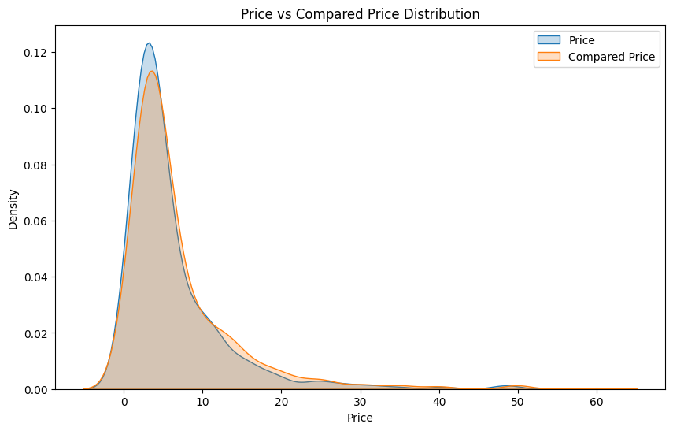
    


This plot illustrates that many products are sold below their recommended price, indicating that the store is consistently promoting offers and discounts.

### Orders

This dataset is list of the products ordered by a user.


```python
orders_df.head()
```


<div>
<style scoped>
    .dataframe tbody tr th:only-of-type {
        vertical-align: middle;
    }

    .dataframe tbody tr th {
        vertical-align: top;
    }

    .dataframe thead th {
        text-align: right;
    }
</style>
<table border="1" class="dataframe">
  <thead>
    <tr style="text-align: right;">
      <th></th>
      <th>id</th>
      <th>user_id</th>
      <th>created_at</th>
      <th>order_date</th>
      <th>user_order_seq</th>
      <th>ordered_items</th>
    </tr>
  </thead>
  <tbody>
    <tr>
      <th>10</th>
      <td>2204073066628</td>
      <td>62e271062eb827e411bd73941178d29b022f5f2de9d37f...</td>
      <td>2020-04-30 14:32:19</td>
      <td>2020-04-30</td>
      <td>1</td>
      <td>[33618849693828, 33618860179588, 3361887404045...</td>
    </tr>
    <tr>
      <th>20</th>
      <td>2204707520644</td>
      <td>bf591c887c46d5d3513142b6a855dd7ffb9cc00697f6f5...</td>
      <td>2020-04-30 17:39:00</td>
      <td>2020-04-30</td>
      <td>1</td>
      <td>[33618835243140, 33618835964036, 3361886244058...</td>
    </tr>
    <tr>
      <th>21</th>
      <td>2204838822020</td>
      <td>329f08c66abb51f8c0b8a9526670da2d94c0c6eef06700...</td>
      <td>2020-04-30 18:12:30</td>
      <td>2020-04-30</td>
      <td>1</td>
      <td>[33618891145348, 33618893570180, 3361889766618...</td>
    </tr>
    <tr>
      <th>34</th>
      <td>2208967852164</td>
      <td>f6451fce7b1c58d0effbe37fcb4e67b718193562766470...</td>
      <td>2020-05-01 19:44:11</td>
      <td>2020-05-01</td>
      <td>1</td>
      <td>[33618830196868, 33618846580868, 3361891234624...</td>
    </tr>
    <tr>
      <th>49</th>
      <td>2215889436804</td>
      <td>68e872ff888303bff58ec56a3a986f77ddebdbe5c279e7...</td>
      <td>2020-05-03 21:56:14</td>
      <td>2020-05-03</td>
      <td>1</td>
      <td>[33667166699652, 33667166699652, 3366717122163...</td>
    </tr>
  </tbody>
</table>
</div>


```python
print("Orders DataFrame shape:", orders_df.shape)
print("Missing values in Orders DataFrame:\n", orders_df.isnull().sum())
```

    Orders DataFrame shape: (8773, 6)
    Missing values in Orders DataFrame:
     id                0
    user_id           0
    created_at        0
    order_date        0
    user_order_seq    0
    ordered_items     0
    dtype: int64


```python
print("Unique users in Orders DataFrame:", orders_df['user_id'].nunique())
```

    Unique users in Orders DataFrame: 4983


```python
orders_per_user = orders_df['user_id'].value_counts()
print(f"Orders per user statistics:\n{orders_per_user.describe()}")

plt.figure(figsize=(10, 6))
sns.histplot(orders_per_user, bins=30, kde=False)
plt.title('Distribution of Number of Orders per User')
plt.xlabel('Number of Orders')
plt.ylabel('Number of Users')
plt.show()
```

    Orders per user statistics:
    count    4983.000000
    mean        1.760586
    std         1.936537
    min         1.000000
    25%         1.000000
    50%         1.000000
    75%         2.000000
    max        25.000000
    Name: count, dtype: float64


    
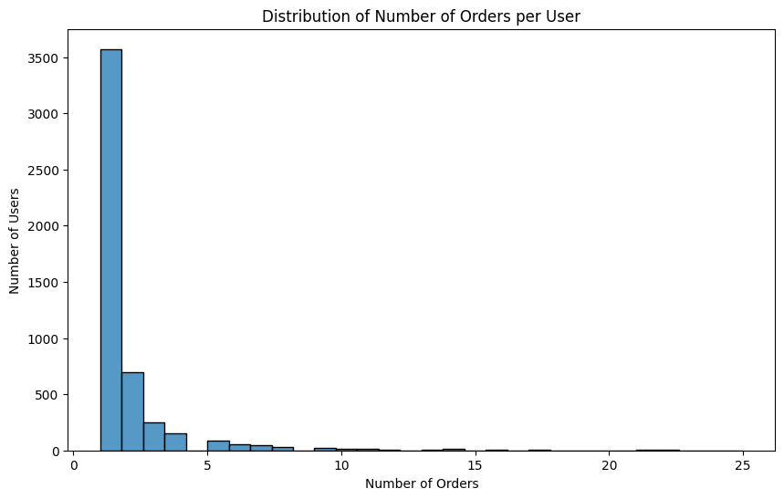
    


While most users ordered only once, others use the platform far more frequently, with some placing as many as 25 orders.

### Regulars

Here we obtain the moment when a product was marked as regular by a user.


```python
regulars_df.head()
```


<div>
<style scoped>
    .dataframe tbody tr th:only-of-type {
        vertical-align: middle;
    }

    .dataframe tbody tr th {
        vertical-align: top;
    }

    .dataframe thead th {
        text-align: right;
    }
</style>
<table border="1" class="dataframe">
  <thead>
    <tr style="text-align: right;">
      <th></th>
      <th>user_id</th>
      <th>variant_id</th>
      <th>created_at</th>
    </tr>
  </thead>
  <tbody>
    <tr>
      <th>3</th>
      <td>68e872ff888303bff58ec56a3a986f77ddebdbe5c279e7...</td>
      <td>33618848088196</td>
      <td>2020-04-30 15:07:03</td>
    </tr>
    <tr>
      <th>11</th>
      <td>aed88fc0b004270a62ff1fe4b94141f6b1db1496dbb0c0...</td>
      <td>33667178659972</td>
      <td>2020-05-05 23:34:35</td>
    </tr>
    <tr>
      <th>18</th>
      <td>68e872ff888303bff58ec56a3a986f77ddebdbe5c279e7...</td>
      <td>33619009208452</td>
      <td>2020-04-30 15:07:03</td>
    </tr>
    <tr>
      <th>46</th>
      <td>aed88fc0b004270a62ff1fe4b94141f6b1db1496dbb0c0...</td>
      <td>33667305373828</td>
      <td>2020-05-05 23:34:35</td>
    </tr>
    <tr>
      <th>47</th>
      <td>4594e99557113d5a1c5b59bf31b8704aafe5c7bd180b32...</td>
      <td>33667247341700</td>
      <td>2020-05-06 14:42:11</td>
    </tr>
  </tbody>
</table>
</div>


```python
print("Regulars DataFrame shape:", regulars_df.shape)
print("Missing values in Regulars DataFrame:\n", regulars_df.isnull().sum())
```

    Regulars DataFrame shape: (18105, 3)
    Missing values in Regulars DataFrame:
     user_id       0
    variant_id    0
    created_at    0
    dtype: int64


```python
print("Unique Regulars DataFrame:", regulars_df['variant_id'].nunique())
```

    Unique Regulars DataFrame: 1843


```python
regulars_per_user = regulars_df['user_id'].value_counts()
print(f"Regulars per user statistics:\n{regulars_per_user.describe()}")
```

    Regulars per user statistics:
    count    1448.000000
    mean       12.503453
    std        36.203697
    min         1.000000
    25%         1.000000
    50%         3.000000
    75%        12.000000
    max       726.000000
    Name: count, dtype: float64


The distribution of regular products per user is highly skewed. While most users keep only a few regular items, typically fewer than 10, the average is pulled up by a small group of outliers, with some users adding hundreds of products.

### Users

In this dataset we have the user information.


```python
users_df.head()
```


<div>
<style scoped>
    .dataframe tbody tr th:only-of-type {
        vertical-align: middle;
    }

    .dataframe tbody tr th {
        vertical-align: top;
    }

    .dataframe thead th {
        text-align: right;
    }
</style>
<table border="1" class="dataframe">
  <thead>
    <tr style="text-align: right;">
      <th></th>
      <th>user_id</th>
      <th>user_segment</th>
      <th>user_nuts1</th>
      <th>first_ordered_at</th>
      <th>customer_cohort_month</th>
      <th>count_people</th>
      <th>count_adults</th>
      <th>count_children</th>
      <th>count_babies</th>
      <th>count_pets</th>
    </tr>
  </thead>
  <tbody>
    <tr>
      <th>2160</th>
      <td>0e823a42e107461379e5b5613b7aa00537a72e1b0eaa7a...</td>
      <td>Top Up</td>
      <td>UKH</td>
      <td>2021-05-08 13:33:49</td>
      <td>2021-05-01 00:00:00</td>
      <td>NaN</td>
      <td>NaN</td>
      <td>NaN</td>
      <td>NaN</td>
      <td>NaN</td>
    </tr>
    <tr>
      <th>1123</th>
      <td>15768ced9bed648f745a7aa566a8895f7a73b9a47c1d4f...</td>
      <td>Top Up</td>
      <td>UKJ</td>
      <td>2021-11-17 16:30:20</td>
      <td>2021-11-01 00:00:00</td>
      <td>NaN</td>
      <td>NaN</td>
      <td>NaN</td>
      <td>NaN</td>
      <td>NaN</td>
    </tr>
    <tr>
      <th>1958</th>
      <td>33e0cb6eacea0775e34adbaa2c1dec16b9d6484e6b9324...</td>
      <td>Top Up</td>
      <td>UKD</td>
      <td>2022-03-09 23:12:25</td>
      <td>2022-03-01 00:00:00</td>
      <td>NaN</td>
      <td>NaN</td>
      <td>NaN</td>
      <td>NaN</td>
      <td>NaN</td>
    </tr>
    <tr>
      <th>675</th>
      <td>57ca7591dc79825df0cecc4836a58e6062454555c86c35...</td>
      <td>Top Up</td>
      <td>UKI</td>
      <td>2021-04-23 16:29:02</td>
      <td>2021-04-01 00:00:00</td>
      <td>NaN</td>
      <td>NaN</td>
      <td>NaN</td>
      <td>NaN</td>
      <td>NaN</td>
    </tr>
    <tr>
      <th>4694</th>
      <td>085d8e598139ce6fc9f75d9de97960fa9e1457b409ec00...</td>
      <td>Top Up</td>
      <td>UKJ</td>
      <td>2021-11-02 13:50:06</td>
      <td>2021-11-01 00:00:00</td>
      <td>NaN</td>
      <td>NaN</td>
      <td>NaN</td>
      <td>NaN</td>
      <td>NaN</td>
    </tr>
  </tbody>
</table>
</div>


```python
print("Users DataFrame shape:", users_df.shape)
print("Missing values in Users DataFrame:\n", users_df.isnull().sum())
```

    Users DataFrame shape: (4983, 10)
    Missing values in Users DataFrame:
     user_id                     0
    user_segment                0
    user_nuts1                 51
    first_ordered_at            0
    customer_cohort_month       0
    count_people             4658
    count_adults             4658
    count_children           4658
    count_babies             4658
    count_pets               4658
    dtype: int64


```python
users_df.describe(include='all')
```


<div>
<style scoped>
    .dataframe tbody tr th:only-of-type {
        vertical-align: middle;
    }

    .dataframe tbody tr th {
        vertical-align: top;
    }

    .dataframe thead th {
        text-align: right;
    }
</style>
<table border="1" class="dataframe">
  <thead>
    <tr style="text-align: right;">
      <th></th>
      <th>user_id</th>
      <th>user_segment</th>
      <th>user_nuts1</th>
      <th>first_ordered_at</th>
      <th>customer_cohort_month</th>
      <th>count_people</th>
      <th>count_adults</th>
      <th>count_children</th>
      <th>count_babies</th>
      <th>count_pets</th>
    </tr>
  </thead>
  <tbody>
    <tr>
      <th>count</th>
      <td>4983</td>
      <td>4983</td>
      <td>4932</td>
      <td>4983</td>
      <td>4983</td>
      <td>325.000000</td>
      <td>325.000000</td>
      <td>325.000000</td>
      <td>325.000000</td>
      <td>325.000000</td>
    </tr>
    <tr>
      <th>unique</th>
      <td>4983</td>
      <td>2</td>
      <td>12</td>
      <td>4982</td>
      <td>24</td>
      <td>NaN</td>
      <td>NaN</td>
      <td>NaN</td>
      <td>NaN</td>
      <td>NaN</td>
    </tr>
    <tr>
      <th>top</th>
      <td>d96aadc220f2776037e519f2c3bd4a2f0199658cc45b29...</td>
      <td>Top Up</td>
      <td>UKI</td>
      <td>2021-11-03 19:51:46</td>
      <td>2022-01-01 00:00:00</td>
      <td>NaN</td>
      <td>NaN</td>
      <td>NaN</td>
      <td>NaN</td>
      <td>NaN</td>
    </tr>
    <tr>
      <th>freq</th>
      <td>1</td>
      <td>2643</td>
      <td>1318</td>
      <td>2</td>
      <td>688</td>
      <td>NaN</td>
      <td>NaN</td>
      <td>NaN</td>
      <td>NaN</td>
      <td>NaN</td>
    </tr>
    <tr>
      <th>mean</th>
      <td>NaN</td>
      <td>NaN</td>
      <td>NaN</td>
      <td>NaN</td>
      <td>NaN</td>
      <td>2.787692</td>
      <td>2.003077</td>
      <td>0.707692</td>
      <td>0.076923</td>
      <td>0.636923</td>
    </tr>
    <tr>
      <th>std</th>
      <td>NaN</td>
      <td>NaN</td>
      <td>NaN</td>
      <td>NaN</td>
      <td>NaN</td>
      <td>1.365753</td>
      <td>0.869577</td>
      <td>1.026246</td>
      <td>0.289086</td>
      <td>0.995603</td>
    </tr>
    <tr>
      <th>min</th>
      <td>NaN</td>
      <td>NaN</td>
      <td>NaN</td>
      <td>NaN</td>
      <td>NaN</td>
      <td>0.000000</td>
      <td>0.000000</td>
      <td>0.000000</td>
      <td>0.000000</td>
      <td>0.000000</td>
    </tr>
    <tr>
      <th>25%</th>
      <td>NaN</td>
      <td>NaN</td>
      <td>NaN</td>
      <td>NaN</td>
      <td>NaN</td>
      <td>2.000000</td>
      <td>2.000000</td>
      <td>0.000000</td>
      <td>0.000000</td>
      <td>0.000000</td>
    </tr>
    <tr>
      <th>50%</th>
      <td>NaN</td>
      <td>NaN</td>
      <td>NaN</td>
      <td>NaN</td>
      <td>NaN</td>
      <td>3.000000</td>
      <td>2.000000</td>
      <td>0.000000</td>
      <td>0.000000</td>
      <td>0.000000</td>
    </tr>
    <tr>
      <th>75%</th>
      <td>NaN</td>
      <td>NaN</td>
      <td>NaN</td>
      <td>NaN</td>
      <td>NaN</td>
      <td>4.000000</td>
      <td>2.000000</td>
      <td>1.000000</td>
      <td>0.000000</td>
      <td>1.000000</td>
    </tr>
    <tr>
      <th>max</th>
      <td>NaN</td>
      <td>NaN</td>
      <td>NaN</td>
      <td>NaN</td>
      <td>NaN</td>
      <td>8.000000</td>
      <td>7.000000</td>
      <td>6.000000</td>
      <td>2.000000</td>
      <td>6.000000</td>
    </tr>
  </tbody>
</table>
</div>


```python
print(f"Users per segment:\n{users_df['user_segment'].value_counts()}")
print(f"\nUsers per nuts1 region:\n{users_df['user_nuts1'].value_counts()}")
```

    Users per segment:
    user_segment
    Top Up         2643
    Proposition    2340
    Name: count, dtype: int64
    
    Users per nuts1 region:
    user_nuts1
    UKI    1318
    UKJ     745
    UKK     602
    UKH     414
    UKD     358
    UKM     315
    UKE     303
    UKG     295
    UKF     252
    UKL     224
    UKC     102
    UKN       4
    Name: count, dtype: int64


```python
# Different values in counts
for col in ['count_people', 'count_children', 'count_adults', 'count_babies', 'count_pets']:
    print(f"\nValue counts for {col}:\n{users_df[col].value_counts(dropna=False)}")
```

    
    Value counts for count_people:
    count_people
    NaN    4658
    2.0      97
    3.0      68
    4.0      67
    1.0      57
    5.0      24
    6.0       8
    0.0       2
    7.0       1
    8.0       1
    Name: count, dtype: int64
    
    Value counts for count_children:
    count_children
    NaN    4658
    0.0     195
    2.0      58
    1.0      55
    3.0      12
    4.0       3
    5.0       1
    6.0       1
    Name: count, dtype: int64
    
    Value counts for count_adults:
    count_adults
    NaN    4658
    2.0     201
    1.0      71
    3.0      32
    4.0      11
    5.0       5
    0.0       3
    7.0       1
    6.0       1
    Name: count, dtype: int64
    
    Value counts for count_babies:
    count_babies
    NaN    4658
    0.0     302
    1.0      21
    2.0       2
    Name: count, dtype: int64
    
    Value counts for count_pets:
    count_pets
    NaN    4658
    0.0     193
    1.0      87
    2.0      28
    3.0       8
    4.0       6
    5.0       2
    6.0       1
    Name: count, dtype: int64


Here we can see that several `count` features contain missing values, likely because many users did not provide responses. This results in skewed statistics, since answered fields are heavily outnumbered by unanswered ones.
On the other hand, when looking at user segmentation, we notice that there are slightly more Top Up users than Proposition users. Additionally, the `nuts1` feature highlights that London is the most represented region among customers.

### Abandoned + Inventory

Merging these dataframes we can understand what type of products tend to be abandoned.


```python
abandoned_inventory_df = pd.merge(abandoned_carts_df.explode('variant_id'), inventory_df, left_on='variant_id', right_on='variant_id', how='left')
abandoned_inventory_df.head()
```


<div>
<style scoped>
    .dataframe tbody tr th:only-of-type {
        vertical-align: middle;
    }

    .dataframe tbody tr th {
        vertical-align: top;
    }

    .dataframe thead th {
        text-align: right;
    }
</style>
<table border="1" class="dataframe">
  <thead>
    <tr style="text-align: right;">
      <th></th>
      <th>id</th>
      <th>user_id</th>
      <th>created_at</th>
      <th>variant_id</th>
      <th>price</th>
      <th>compare_at_price</th>
      <th>vendor</th>
      <th>product_type</th>
      <th>tags</th>
      <th>price_diff</th>
    </tr>
  </thead>
  <tbody>
    <tr>
      <th>0</th>
      <td>12858560217220</td>
      <td>5c4e5953f13ddc3bc9659a3453356155e5efe4739d7a2b...</td>
      <td>2020-05-20 13:53:24</td>
      <td>33826459287684</td>
      <td>NaN</td>
      <td>NaN</td>
      <td>NaN</td>
      <td>NaN</td>
      <td>NaN</td>
      <td>NaN</td>
    </tr>
    <tr>
      <th>1</th>
      <td>12858560217220</td>
      <td>5c4e5953f13ddc3bc9659a3453356155e5efe4739d7a2b...</td>
      <td>2020-05-20 13:53:24</td>
      <td>33826457616516</td>
      <td>NaN</td>
      <td>NaN</td>
      <td>NaN</td>
      <td>NaN</td>
      <td>NaN</td>
      <td>NaN</td>
    </tr>
    <tr>
      <th>2</th>
      <td>12858560217220</td>
      <td>5c4e5953f13ddc3bc9659a3453356155e5efe4739d7a2b...</td>
      <td>2020-05-20 13:53:24</td>
      <td>33667192127620</td>
      <td>NaN</td>
      <td>NaN</td>
      <td>NaN</td>
      <td>NaN</td>
      <td>NaN</td>
      <td>NaN</td>
    </tr>
    <tr>
      <th>3</th>
      <td>12858560217220</td>
      <td>5c4e5953f13ddc3bc9659a3453356155e5efe4739d7a2b...</td>
      <td>2020-05-20 13:53:24</td>
      <td>33826412331140</td>
      <td>NaN</td>
      <td>NaN</td>
      <td>NaN</td>
      <td>NaN</td>
      <td>NaN</td>
      <td>NaN</td>
    </tr>
    <tr>
      <th>4</th>
      <td>12858560217220</td>
      <td>5c4e5953f13ddc3bc9659a3453356155e5efe4739d7a2b...</td>
      <td>2020-05-20 13:53:24</td>
      <td>33826472558724</td>
      <td>3.99</td>
      <td>4.09</td>
      <td>profusion</td>
      <td>cooking-ingredients</td>
      <td>[salt-pepper, vegan]</td>
      <td>0.1</td>
    </tr>
  </tbody>
</table>
</div>


```python
plt.figure(figsize=(12, 6))
sns.countplot(data=abandoned_inventory_df, x='product_type', order=abandoned_inventory_df['product_type'].value_counts().index)
plt.title('Product Types of Abandoned Items')
plt.xlabel('Product Type')
plt.ylabel('Number of Abandoned Items')
plt.xticks(rotation=90)
plt.show()
```


    
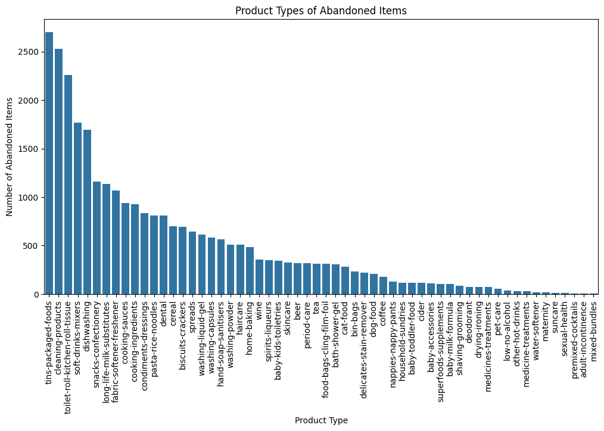
    


The products most commonly abandoned in carts are also among the most frequently purchased by users (as shown later). This suggests that these items are popular and in demand, even if they are not always purchased immediately.

### Orders + Users

Joining these dataframes can let us know the type of customer that orders more and which type of product.


```python
user_orders_df = pd.merge(orders_df, users_df, on='user_id', how='left')
user_orders_df.head()
```


<div>
<style scoped>
    .dataframe tbody tr th:only-of-type {
        vertical-align: middle;
    }

    .dataframe tbody tr th {
        vertical-align: top;
    }

    .dataframe thead th {
        text-align: right;
    }
</style>
<table border="1" class="dataframe">
  <thead>
    <tr style="text-align: right;">
      <th></th>
      <th>id</th>
      <th>user_id</th>
      <th>created_at</th>
      <th>order_date</th>
      <th>user_order_seq</th>
      <th>ordered_items</th>
      <th>user_segment</th>
      <th>user_nuts1</th>
      <th>first_ordered_at</th>
      <th>customer_cohort_month</th>
      <th>count_people</th>
      <th>count_adults</th>
      <th>count_children</th>
      <th>count_babies</th>
      <th>count_pets</th>
    </tr>
  </thead>
  <tbody>
    <tr>
      <th>0</th>
      <td>2204073066628</td>
      <td>62e271062eb827e411bd73941178d29b022f5f2de9d37f...</td>
      <td>2020-04-30 14:32:19</td>
      <td>2020-04-30</td>
      <td>1</td>
      <td>[33618849693828, 33618860179588, 3361887404045...</td>
      <td>Proposition</td>
      <td>UKI</td>
      <td>2020-04-30 14:32:19</td>
      <td>2020-04-01 00:00:00</td>
      <td>4.0</td>
      <td>4.0</td>
      <td>0.0</td>
      <td>0.0</td>
      <td>0.0</td>
    </tr>
    <tr>
      <th>1</th>
      <td>2204707520644</td>
      <td>bf591c887c46d5d3513142b6a855dd7ffb9cc00697f6f5...</td>
      <td>2020-04-30 17:39:00</td>
      <td>2020-04-30</td>
      <td>1</td>
      <td>[33618835243140, 33618835964036, 3361886244058...</td>
      <td>Proposition</td>
      <td>UKM</td>
      <td>2020-04-30 17:39:00</td>
      <td>2020-04-01 00:00:00</td>
      <td>4.0</td>
      <td>2.0</td>
      <td>2.0</td>
      <td>0.0</td>
      <td>1.0</td>
    </tr>
    <tr>
      <th>2</th>
      <td>2204838822020</td>
      <td>329f08c66abb51f8c0b8a9526670da2d94c0c6eef06700...</td>
      <td>2020-04-30 18:12:30</td>
      <td>2020-04-30</td>
      <td>1</td>
      <td>[33618891145348, 33618893570180, 3361889766618...</td>
      <td>Top Up</td>
      <td>UKF</td>
      <td>2020-04-30 18:12:30</td>
      <td>2020-04-01 00:00:00</td>
      <td>4.0</td>
      <td>2.0</td>
      <td>2.0</td>
      <td>0.0</td>
      <td>1.0</td>
    </tr>
    <tr>
      <th>3</th>
      <td>2208967852164</td>
      <td>f6451fce7b1c58d0effbe37fcb4e67b718193562766470...</td>
      <td>2020-05-01 19:44:11</td>
      <td>2020-05-01</td>
      <td>1</td>
      <td>[33618830196868, 33618846580868, 3361891234624...</td>
      <td>Proposition</td>
      <td>UKI</td>
      <td>2020-05-01 19:44:11</td>
      <td>2020-05-01 00:00:00</td>
      <td>4.0</td>
      <td>3.0</td>
      <td>1.0</td>
      <td>0.0</td>
      <td>1.0</td>
    </tr>
    <tr>
      <th>4</th>
      <td>2215889436804</td>
      <td>68e872ff888303bff58ec56a3a986f77ddebdbe5c279e7...</td>
      <td>2020-05-03 21:56:14</td>
      <td>2020-05-03</td>
      <td>1</td>
      <td>[33667166699652, 33667166699652, 3366717122163...</td>
      <td>Proposition</td>
      <td>UKI</td>
      <td>2020-05-03 21:56:14</td>
      <td>2020-05-01 00:00:00</td>
      <td>2.0</td>
      <td>2.0</td>
      <td>0.0</td>
      <td>0.0</td>
      <td>0.0</td>
    </tr>
  </tbody>
</table>
</div>


```python
# Plotting the number of orders by user nuts and segment
plt.figure(figsize=(12, 6))
sns.countplot(data=user_orders_df, x='user_nuts1', hue='user_segment')
plt.title('Number of Orders by User NUTS1 and Segment')
plt.xlabel('User NUTS1')
plt.ylabel('Number of Orders')
plt.legend(title='User Segment')
plt.show()
```


    
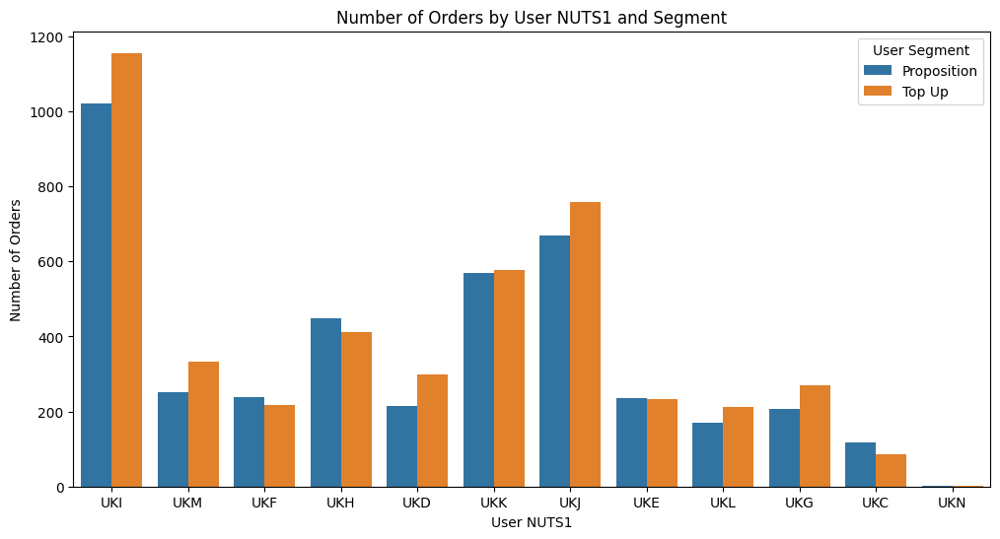
    


Here, we can see that London stands out as the region with the highest number of orders, with a significant gap compared to the second highest region. The other leading regions are also located in the south. Additionally, the majority of orders were placed by Top Up users.

### Orders + Users + Inventory

Before merging, we have to explode the `ordered_items` feature in order to have only one per row.


```python
user_orders_exploded_df = user_orders_df.explode('ordered_items')
user_orders_inventory_df = pd.merge(user_orders_exploded_df, inventory_df, left_on='ordered_items', right_on='variant_id', how='left')
user_orders_inventory_df.head()
```


<div>
<style scoped>
    .dataframe tbody tr th:only-of-type {
        vertical-align: middle;
    }

    .dataframe tbody tr th {
        vertical-align: top;
    }

    .dataframe thead th {
        text-align: right;
    }
</style>
<table border="1" class="dataframe">
  <thead>
    <tr style="text-align: right;">
      <th></th>
      <th>id</th>
      <th>user_id</th>
      <th>created_at</th>
      <th>order_date</th>
      <th>user_order_seq</th>
      <th>ordered_items</th>
      <th>user_segment</th>
      <th>user_nuts1</th>
      <th>first_ordered_at</th>
      <th>customer_cohort_month</th>
      <th>...</th>
      <th>count_children</th>
      <th>count_babies</th>
      <th>count_pets</th>
      <th>variant_id</th>
      <th>price</th>
      <th>compare_at_price</th>
      <th>vendor</th>
      <th>product_type</th>
      <th>tags</th>
      <th>price_diff</th>
    </tr>
  </thead>
  <tbody>
    <tr>
      <th>0</th>
      <td>2204073066628</td>
      <td>62e271062eb827e411bd73941178d29b022f5f2de9d37f...</td>
      <td>2020-04-30 14:32:19</td>
      <td>2020-04-30</td>
      <td>1</td>
      <td>33618849693828</td>
      <td>Proposition</td>
      <td>UKI</td>
      <td>2020-04-30 14:32:19</td>
      <td>2020-04-01 00:00:00</td>
      <td>...</td>
      <td>0.0</td>
      <td>0.0</td>
      <td>0.0</td>
      <td>NaN</td>
      <td>NaN</td>
      <td>NaN</td>
      <td>NaN</td>
      <td>NaN</td>
      <td>NaN</td>
      <td>NaN</td>
    </tr>
    <tr>
      <th>1</th>
      <td>2204073066628</td>
      <td>62e271062eb827e411bd73941178d29b022f5f2de9d37f...</td>
      <td>2020-04-30 14:32:19</td>
      <td>2020-04-30</td>
      <td>1</td>
      <td>33618860179588</td>
      <td>Proposition</td>
      <td>UKI</td>
      <td>2020-04-30 14:32:19</td>
      <td>2020-04-01 00:00:00</td>
      <td>...</td>
      <td>0.0</td>
      <td>0.0</td>
      <td>0.0</td>
      <td>NaN</td>
      <td>NaN</td>
      <td>NaN</td>
      <td>NaN</td>
      <td>NaN</td>
      <td>NaN</td>
      <td>NaN</td>
    </tr>
    <tr>
      <th>2</th>
      <td>2204073066628</td>
      <td>62e271062eb827e411bd73941178d29b022f5f2de9d37f...</td>
      <td>2020-04-30 14:32:19</td>
      <td>2020-04-30</td>
      <td>1</td>
      <td>33618874040452</td>
      <td>Proposition</td>
      <td>UKI</td>
      <td>2020-04-30 14:32:19</td>
      <td>2020-04-01 00:00:00</td>
      <td>...</td>
      <td>0.0</td>
      <td>0.0</td>
      <td>0.0</td>
      <td>NaN</td>
      <td>NaN</td>
      <td>NaN</td>
      <td>NaN</td>
      <td>NaN</td>
      <td>NaN</td>
      <td>NaN</td>
    </tr>
    <tr>
      <th>3</th>
      <td>2204073066628</td>
      <td>62e271062eb827e411bd73941178d29b022f5f2de9d37f...</td>
      <td>2020-04-30 14:32:19</td>
      <td>2020-04-30</td>
      <td>1</td>
      <td>33618907005060</td>
      <td>Proposition</td>
      <td>UKI</td>
      <td>2020-04-30 14:32:19</td>
      <td>2020-04-01 00:00:00</td>
      <td>...</td>
      <td>0.0</td>
      <td>0.0</td>
      <td>0.0</td>
      <td>NaN</td>
      <td>NaN</td>
      <td>NaN</td>
      <td>NaN</td>
      <td>NaN</td>
      <td>NaN</td>
      <td>NaN</td>
    </tr>
    <tr>
      <th>4</th>
      <td>2204073066628</td>
      <td>62e271062eb827e411bd73941178d29b022f5f2de9d37f...</td>
      <td>2020-04-30 14:32:19</td>
      <td>2020-04-30</td>
      <td>1</td>
      <td>33618907005060</td>
      <td>Proposition</td>
      <td>UKI</td>
      <td>2020-04-30 14:32:19</td>
      <td>2020-04-01 00:00:00</td>
      <td>...</td>
      <td>0.0</td>
      <td>0.0</td>
      <td>0.0</td>
      <td>NaN</td>
      <td>NaN</td>
      <td>NaN</td>
      <td>NaN</td>
      <td>NaN</td>
      <td>NaN</td>
      <td>NaN</td>
    </tr>
  </tbody>
</table>
<p>5 rows × 22 columns</p>
</div>


```python
# Plot the distribution of product categories ordered by user segment
plt.figure(figsize=(12, 6))
sns.countplot(data=user_orders_inventory_df, x='product_type', hue='user_segment', order=user_orders_inventory_df['product_type'].value_counts().index)
plt.title('Product Categories Ordered by User Segment')
plt.xlabel('Product Type')
plt.ylabel('Number of Orders')
plt.legend(title='User Segment')
plt.xticks(rotation=90)
plt.show()
```


    
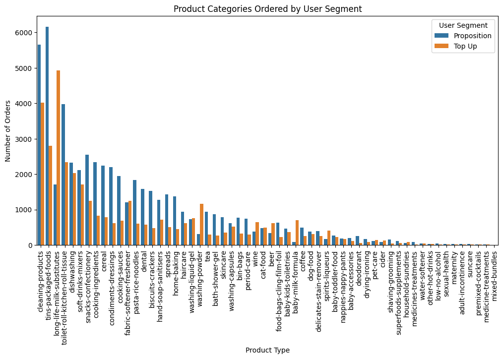
    


Looking at the plot we can see that the most ordered categories were ordered mostly by Proposition Users.

### Regulars + Inventory

With this merge we can get to know with type of products are the regulars.


```python
regulars_inventory_df = regulars_df.merge(inventory_df, on='variant_id', how='left')
regulars_inventory_df.head()
```


<div>
<style scoped>
    .dataframe tbody tr th:only-of-type {
        vertical-align: middle;
    }

    .dataframe tbody tr th {
        vertical-align: top;
    }

    .dataframe thead th {
        text-align: right;
    }
</style>
<table border="1" class="dataframe">
  <thead>
    <tr style="text-align: right;">
      <th></th>
      <th>user_id</th>
      <th>variant_id</th>
      <th>created_at</th>
      <th>price</th>
      <th>compare_at_price</th>
      <th>vendor</th>
      <th>product_type</th>
      <th>tags</th>
      <th>price_diff</th>
    </tr>
  </thead>
  <tbody>
    <tr>
      <th>0</th>
      <td>68e872ff888303bff58ec56a3a986f77ddebdbe5c279e7...</td>
      <td>33618848088196</td>
      <td>2020-04-30 15:07:03</td>
      <td>NaN</td>
      <td>NaN</td>
      <td>NaN</td>
      <td>NaN</td>
      <td>NaN</td>
      <td>NaN</td>
    </tr>
    <tr>
      <th>1</th>
      <td>aed88fc0b004270a62ff1fe4b94141f6b1db1496dbb0c0...</td>
      <td>33667178659972</td>
      <td>2020-05-05 23:34:35</td>
      <td>NaN</td>
      <td>NaN</td>
      <td>NaN</td>
      <td>NaN</td>
      <td>NaN</td>
      <td>NaN</td>
    </tr>
    <tr>
      <th>2</th>
      <td>68e872ff888303bff58ec56a3a986f77ddebdbe5c279e7...</td>
      <td>33619009208452</td>
      <td>2020-04-30 15:07:03</td>
      <td>NaN</td>
      <td>NaN</td>
      <td>NaN</td>
      <td>NaN</td>
      <td>NaN</td>
      <td>NaN</td>
    </tr>
    <tr>
      <th>3</th>
      <td>aed88fc0b004270a62ff1fe4b94141f6b1db1496dbb0c0...</td>
      <td>33667305373828</td>
      <td>2020-05-05 23:34:35</td>
      <td>NaN</td>
      <td>NaN</td>
      <td>NaN</td>
      <td>NaN</td>
      <td>NaN</td>
      <td>NaN</td>
    </tr>
    <tr>
      <th>4</th>
      <td>4594e99557113d5a1c5b59bf31b8704aafe5c7bd180b32...</td>
      <td>33667247341700</td>
      <td>2020-05-06 14:42:11</td>
      <td>3.49</td>
      <td>3.5</td>
      <td>method</td>
      <td>cleaning-products</td>
      <td>[cruelty-free, eco, vegan, window-glass-cleaner]</td>
      <td>0.01</td>
    </tr>
  </tbody>
</table>
</div>


```python
# Plot type of products that are regulars
plt.figure(figsize=(12, 6))
sns.countplot(data=regulars_inventory_df, x='product_type', order=regulars_inventory_df['product_type'].value_counts().index)
plt.title('Product Types of Regular Items')
plt.xlabel('Product Type')
plt.ylabel('Count')
plt.xticks(rotation=90)
plt.show()
```


    
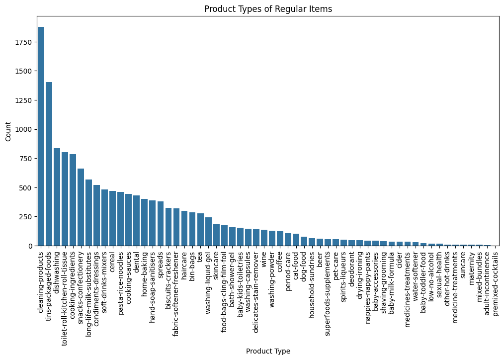
    


The list of regulars looks pretty similar to the most ordered products, which makes sense since the tool is meant to let users easily buy their favorite items again.

### Results

The first takeaways from this analysis are that the most ordered products usually fall within the same categories, showing clear customer preferences. Top Up users are also driving the majority of purchases in the regions with the highest order volumes. Finally, the regulars feature plays a key role, since a large share of orders include regular products, highlighting how important this tool is for customer habits.

## 2. EDA

### Import the dataset

Now, we use the provided dataset to do the EDA.


```python
data = pd.read_csv(DATA_DIR / "box_builder_dataset" / "feature_frame.csv")
data.head()
```


<div>
<style scoped>
    .dataframe tbody tr th:only-of-type {
        vertical-align: middle;
    }

    .dataframe tbody tr th {
        vertical-align: top;
    }

    .dataframe thead th {
        text-align: right;
    }
</style>
<table border="1" class="dataframe">
  <thead>
    <tr style="text-align: right;">
      <th></th>
      <th>variant_id</th>
      <th>product_type</th>
      <th>order_id</th>
      <th>user_id</th>
      <th>created_at</th>
      <th>order_date</th>
      <th>user_order_seq</th>
      <th>outcome</th>
      <th>ordered_before</th>
      <th>abandoned_before</th>
      <th>...</th>
      <th>count_children</th>
      <th>count_babies</th>
      <th>count_pets</th>
      <th>people_ex_baby</th>
      <th>days_since_purchase_variant_id</th>
      <th>avg_days_to_buy_variant_id</th>
      <th>std_days_to_buy_variant_id</th>
      <th>days_since_purchase_product_type</th>
      <th>avg_days_to_buy_product_type</th>
      <th>std_days_to_buy_product_type</th>
    </tr>
  </thead>
  <tbody>
    <tr>
      <th>0</th>
      <td>33826472919172</td>
      <td>ricepastapulses</td>
      <td>2807985930372</td>
      <td>3482464092292</td>
      <td>2020-10-05 16:46:19</td>
      <td>2020-10-05 00:00:00</td>
      <td>3</td>
      <td>0.0</td>
      <td>0.0</td>
      <td>0.0</td>
      <td>...</td>
      <td>0.0</td>
      <td>0.0</td>
      <td>0.0</td>
      <td>2.0</td>
      <td>33.0</td>
      <td>42.0</td>
      <td>31.134053</td>
      <td>30.0</td>
      <td>30.0</td>
      <td>24.27618</td>
    </tr>
    <tr>
      <th>1</th>
      <td>33826472919172</td>
      <td>ricepastapulses</td>
      <td>2808027644036</td>
      <td>3466586718340</td>
      <td>2020-10-05 17:59:51</td>
      <td>2020-10-05 00:00:00</td>
      <td>2</td>
      <td>0.0</td>
      <td>0.0</td>
      <td>0.0</td>
      <td>...</td>
      <td>0.0</td>
      <td>0.0</td>
      <td>0.0</td>
      <td>2.0</td>
      <td>33.0</td>
      <td>42.0</td>
      <td>31.134053</td>
      <td>30.0</td>
      <td>30.0</td>
      <td>24.27618</td>
    </tr>
    <tr>
      <th>2</th>
      <td>33826472919172</td>
      <td>ricepastapulses</td>
      <td>2808099078276</td>
      <td>3481384026244</td>
      <td>2020-10-05 20:08:53</td>
      <td>2020-10-05 00:00:00</td>
      <td>4</td>
      <td>0.0</td>
      <td>0.0</td>
      <td>0.0</td>
      <td>...</td>
      <td>0.0</td>
      <td>0.0</td>
      <td>0.0</td>
      <td>2.0</td>
      <td>33.0</td>
      <td>42.0</td>
      <td>31.134053</td>
      <td>30.0</td>
      <td>30.0</td>
      <td>24.27618</td>
    </tr>
    <tr>
      <th>3</th>
      <td>33826472919172</td>
      <td>ricepastapulses</td>
      <td>2808393957508</td>
      <td>3291363377284</td>
      <td>2020-10-06 08:57:59</td>
      <td>2020-10-06 00:00:00</td>
      <td>2</td>
      <td>0.0</td>
      <td>0.0</td>
      <td>0.0</td>
      <td>...</td>
      <td>0.0</td>
      <td>0.0</td>
      <td>0.0</td>
      <td>2.0</td>
      <td>33.0</td>
      <td>42.0</td>
      <td>31.134053</td>
      <td>30.0</td>
      <td>30.0</td>
      <td>24.27618</td>
    </tr>
    <tr>
      <th>4</th>
      <td>33826472919172</td>
      <td>ricepastapulses</td>
      <td>2808429314180</td>
      <td>3537167515780</td>
      <td>2020-10-06 10:37:05</td>
      <td>2020-10-06 00:00:00</td>
      <td>3</td>
      <td>0.0</td>
      <td>0.0</td>
      <td>0.0</td>
      <td>...</td>
      <td>0.0</td>
      <td>0.0</td>
      <td>0.0</td>
      <td>2.0</td>
      <td>33.0</td>
      <td>42.0</td>
      <td>31.134053</td>
      <td>30.0</td>
      <td>30.0</td>
      <td>24.27618</td>
    </tr>
  </tbody>
</table>
<p>5 rows × 27 columns</p>
</div>


### Errors and sanity checks


```python
print("Feature Frame DataFrame shape:", data.shape)
print(f"Missing values in Feature Frame DataFrame:\n{data.isnull().sum()}")
print("Duplicated rows in Feature Frame DataFrame:", data.duplicated().sum())
print("Unique users in Feature Frame DataFrame:", data['user_id'].nunique())
```

    Feature Frame DataFrame shape: (2880549, 27)
    Missing values in Feature Frame DataFrame:
    variant_id                          0
    product_type                        0
    order_id                            0
    user_id                             0
    created_at                          0
    order_date                          0
    user_order_seq                      0
    outcome                             0
    ordered_before                      0
    abandoned_before                    0
    active_snoozed                      0
    set_as_regular                      0
    normalised_price                    0
    discount_pct                        0
    vendor                              0
    global_popularity                   0
    count_adults                        0
    count_children                      0
    count_babies                        0
    count_pets                          0
    people_ex_baby                      0
    days_since_purchase_variant_id      0
    avg_days_to_buy_variant_id          0
    std_days_to_buy_variant_id          0
    days_since_purchase_product_type    0
    avg_days_to_buy_product_type        0
    std_days_to_buy_product_type        0
    dtype: int64
    Duplicated rows in Feature Frame DataFrame: 0
    Unique users in Feature Frame DataFrame: 1937


```python
data.describe(include='all')
```


<div>
<style scoped>
    .dataframe tbody tr th:only-of-type {
        vertical-align: middle;
    }

    .dataframe tbody tr th {
        vertical-align: top;
    }

    .dataframe thead th {
        text-align: right;
    }
</style>
<table border="1" class="dataframe">
  <thead>
    <tr style="text-align: right;">
      <th></th>
      <th>variant_id</th>
      <th>product_type</th>
      <th>order_id</th>
      <th>user_id</th>
      <th>created_at</th>
      <th>order_date</th>
      <th>user_order_seq</th>
      <th>outcome</th>
      <th>ordered_before</th>
      <th>abandoned_before</th>
      <th>...</th>
      <th>count_children</th>
      <th>count_babies</th>
      <th>count_pets</th>
      <th>people_ex_baby</th>
      <th>days_since_purchase_variant_id</th>
      <th>avg_days_to_buy_variant_id</th>
      <th>std_days_to_buy_variant_id</th>
      <th>days_since_purchase_product_type</th>
      <th>avg_days_to_buy_product_type</th>
      <th>std_days_to_buy_product_type</th>
    </tr>
  </thead>
  <tbody>
    <tr>
      <th>count</th>
      <td>2.880549e+06</td>
      <td>2880549</td>
      <td>2.880549e+06</td>
      <td>2.880549e+06</td>
      <td>2880549</td>
      <td>2880549</td>
      <td>2.880549e+06</td>
      <td>2.880549e+06</td>
      <td>2.880549e+06</td>
      <td>2.880549e+06</td>
      <td>...</td>
      <td>2.880549e+06</td>
      <td>2.880549e+06</td>
      <td>2.880549e+06</td>
      <td>2.880549e+06</td>
      <td>2.880549e+06</td>
      <td>2.880549e+06</td>
      <td>2.880549e+06</td>
      <td>2.880549e+06</td>
      <td>2.880549e+06</td>
      <td>2.880549e+06</td>
    </tr>
    <tr>
      <th>unique</th>
      <td>NaN</td>
      <td>62</td>
      <td>NaN</td>
      <td>NaN</td>
      <td>3446</td>
      <td>149</td>
      <td>NaN</td>
      <td>NaN</td>
      <td>NaN</td>
      <td>NaN</td>
      <td>...</td>
      <td>NaN</td>
      <td>NaN</td>
      <td>NaN</td>
      <td>NaN</td>
      <td>NaN</td>
      <td>NaN</td>
      <td>NaN</td>
      <td>NaN</td>
      <td>NaN</td>
      <td>NaN</td>
    </tr>
    <tr>
      <th>top</th>
      <td>NaN</td>
      <td>tinspackagedfoods</td>
      <td>NaN</td>
      <td>NaN</td>
      <td>2021-03-03 13:06:52</td>
      <td>2021-02-17 00:00:00</td>
      <td>NaN</td>
      <td>NaN</td>
      <td>NaN</td>
      <td>NaN</td>
      <td>...</td>
      <td>NaN</td>
      <td>NaN</td>
      <td>NaN</td>
      <td>NaN</td>
      <td>NaN</td>
      <td>NaN</td>
      <td>NaN</td>
      <td>NaN</td>
      <td>NaN</td>
      <td>NaN</td>
    </tr>
    <tr>
      <th>freq</th>
      <td>NaN</td>
      <td>226474</td>
      <td>NaN</td>
      <td>NaN</td>
      <td>976</td>
      <td>68446</td>
      <td>NaN</td>
      <td>NaN</td>
      <td>NaN</td>
      <td>NaN</td>
      <td>...</td>
      <td>NaN</td>
      <td>NaN</td>
      <td>NaN</td>
      <td>NaN</td>
      <td>NaN</td>
      <td>NaN</td>
      <td>NaN</td>
      <td>NaN</td>
      <td>NaN</td>
      <td>NaN</td>
    </tr>
    <tr>
      <th>mean</th>
      <td>3.401250e+13</td>
      <td>NaN</td>
      <td>2.978388e+12</td>
      <td>3.750025e+12</td>
      <td>NaN</td>
      <td>NaN</td>
      <td>3.289342e+00</td>
      <td>1.153669e-02</td>
      <td>2.113868e-02</td>
      <td>6.092589e-04</td>
      <td>...</td>
      <td>5.492182e-02</td>
      <td>3.538562e-03</td>
      <td>5.134091e-02</td>
      <td>2.072549e+00</td>
      <td>3.312961e+01</td>
      <td>3.523734e+01</td>
      <td>2.645304e+01</td>
      <td>3.143513e+01</td>
      <td>3.088810e+01</td>
      <td>2.594969e+01</td>
    </tr>
    <tr>
      <th>std</th>
      <td>2.786246e+11</td>
      <td>NaN</td>
      <td>2.446292e+11</td>
      <td>1.775710e+11</td>
      <td>NaN</td>
      <td>NaN</td>
      <td>2.140176e+00</td>
      <td>1.067876e-01</td>
      <td>1.438466e-01</td>
      <td>2.467565e-02</td>
      <td>...</td>
      <td>3.276586e-01</td>
      <td>5.938048e-02</td>
      <td>3.013646e-01</td>
      <td>3.943659e-01</td>
      <td>3.707162e+00</td>
      <td>1.057766e+01</td>
      <td>7.168323e+00</td>
      <td>1.227511e+01</td>
      <td>4.330262e+00</td>
      <td>3.278860e+00</td>
    </tr>
    <tr>
      <th>min</th>
      <td>3.361529e+13</td>
      <td>NaN</td>
      <td>2.807986e+12</td>
      <td>3.046041e+12</td>
      <td>NaN</td>
      <td>NaN</td>
      <td>2.000000e+00</td>
      <td>0.000000e+00</td>
      <td>0.000000e+00</td>
      <td>0.000000e+00</td>
      <td>...</td>
      <td>0.000000e+00</td>
      <td>0.000000e+00</td>
      <td>0.000000e+00</td>
      <td>1.000000e+00</td>
      <td>0.000000e+00</td>
      <td>0.000000e+00</td>
      <td>1.414214e+00</td>
      <td>0.000000e+00</td>
      <td>7.000000e+00</td>
      <td>2.828427e+00</td>
    </tr>
    <tr>
      <th>25%</th>
      <td>3.380354e+13</td>
      <td>NaN</td>
      <td>2.875152e+12</td>
      <td>3.745901e+12</td>
      <td>NaN</td>
      <td>NaN</td>
      <td>2.000000e+00</td>
      <td>0.000000e+00</td>
      <td>0.000000e+00</td>
      <td>0.000000e+00</td>
      <td>...</td>
      <td>0.000000e+00</td>
      <td>0.000000e+00</td>
      <td>0.000000e+00</td>
      <td>2.000000e+00</td>
      <td>3.300000e+01</td>
      <td>3.000000e+01</td>
      <td>2.319372e+01</td>
      <td>3.000000e+01</td>
      <td>2.800000e+01</td>
      <td>2.427618e+01</td>
    </tr>
    <tr>
      <th>50%</th>
      <td>3.397325e+13</td>
      <td>NaN</td>
      <td>2.902856e+12</td>
      <td>3.812775e+12</td>
      <td>NaN</td>
      <td>NaN</td>
      <td>3.000000e+00</td>
      <td>0.000000e+00</td>
      <td>0.000000e+00</td>
      <td>0.000000e+00</td>
      <td>...</td>
      <td>0.000000e+00</td>
      <td>0.000000e+00</td>
      <td>0.000000e+00</td>
      <td>2.000000e+00</td>
      <td>3.300000e+01</td>
      <td>3.400000e+01</td>
      <td>2.769305e+01</td>
      <td>3.000000e+01</td>
      <td>3.100000e+01</td>
      <td>2.608188e+01</td>
    </tr>
    <tr>
      <th>75%</th>
      <td>3.428495e+13</td>
      <td>NaN</td>
      <td>2.922034e+12</td>
      <td>3.874925e+12</td>
      <td>NaN</td>
      <td>NaN</td>
      <td>4.000000e+00</td>
      <td>0.000000e+00</td>
      <td>0.000000e+00</td>
      <td>0.000000e+00</td>
      <td>...</td>
      <td>0.000000e+00</td>
      <td>0.000000e+00</td>
      <td>0.000000e+00</td>
      <td>2.000000e+00</td>
      <td>3.300000e+01</td>
      <td>4.000000e+01</td>
      <td>3.059484e+01</td>
      <td>3.000000e+01</td>
      <td>3.400000e+01</td>
      <td>2.796118e+01</td>
    </tr>
    <tr>
      <th>max</th>
      <td>3.454300e+13</td>
      <td>NaN</td>
      <td>3.643302e+12</td>
      <td>5.029635e+12</td>
      <td>NaN</td>
      <td>NaN</td>
      <td>2.100000e+01</td>
      <td>1.000000e+00</td>
      <td>1.000000e+00</td>
      <td>1.000000e+00</td>
      <td>...</td>
      <td>3.000000e+00</td>
      <td>1.000000e+00</td>
      <td>6.000000e+00</td>
      <td>5.000000e+00</td>
      <td>1.480000e+02</td>
      <td>8.400000e+01</td>
      <td>5.868986e+01</td>
      <td>1.480000e+02</td>
      <td>3.950000e+01</td>
      <td>3.564191e+01</td>
    </tr>
  </tbody>
</table>
<p>11 rows × 27 columns</p>
</div>


### Correlations


```python
plt.figure(figsize=(14, 10))
numerical_cols = data.select_dtypes(include=['float64', 'int64']).columns
correlation_matrix = data[numerical_cols].corr()
sns.heatmap(correlation_matrix, annot=True, fmt=".2f", cmap='coolwarm', square=True)
plt.title('Correlation Matrix for Numerical Features')
plt.show()
```


    
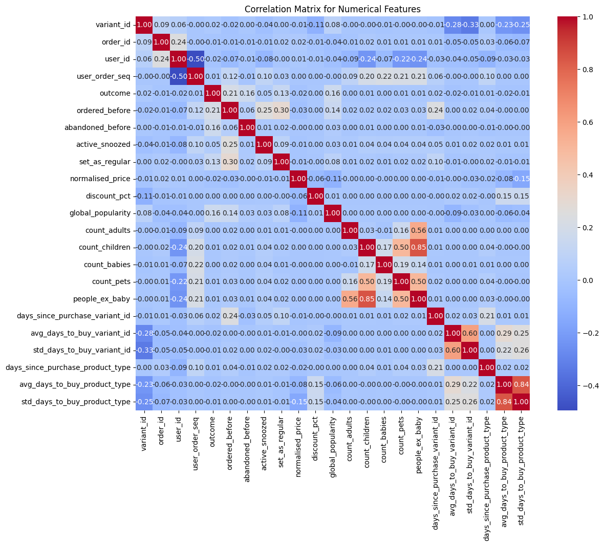
    


There is an interesting correlation between `outcome` and other features such as `ordered_before`, `abandoned_before`, `set_as_regular` and `global_popularity`.
Another important relation could be the one between family information and `user_order_sequence`.
Also, we can see that there is a relation between the number of days to buy a product per type and the discount percetage.
Next, we’ll take a closer look at these relationships to better understand the patterns behind them.

### Data integrity


```python
print(f"Outcome variable distribution:\n{data['outcome'].value_counts(normalize=True)}")
```

    Outcome variable distribution:
    outcome
    0.0    0.988463
    1.0    0.011537
    Name: proportion, dtype: float64


```python
features = ['ordered_before', 'abandoned_before', 'set_as_regular']
fig, axes = plt.subplots(1, 3, figsize=(16, 6))
for i, feature in enumerate(features):
    ax = axes[i]
    crosstab = pd.crosstab(data[feature], data['outcome'], normalize='index')
    sns.heatmap(crosstab, annot=True, fmt=".2f", cmap='Blues', ax=ax)
    ax.set_title(f'Outcome vs {feature}')
    ax.set_xlabel('Outcome')
    ax.set_ylabel(feature)
plt.tight_layout()
plt.show()
```


    
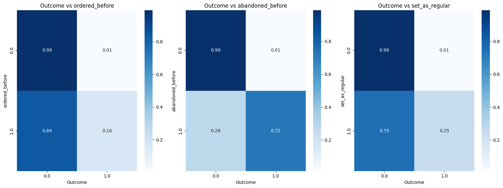
    


These matrices show interesting results:
- `ordered_before`: If something has been ordered before, it is more likely to result as a positive outcome. However, there is a big likelihood to not be ordered.
- `abandoned_before`: If a product has been abandoned before, it is more likely to be purchased than not to. This could mean that people add products to the cart in ordeer to buy them in the future.
- `set_as_regular`: If a product is a regular, it is likely to be ordered but there is a big chance not to.


```python
plt.figure(figsize=(10, 6))
sns.histplot(data=data, x='global_popularity', hue='outcome', bins=30, kde=True, element='step', stat='density', common_norm=False)
plt.title('Global Popularity Distribution by Outcome')
plt.xlabel('Global Popularity')
plt.ylabel('Density')
plt.show()
```


    
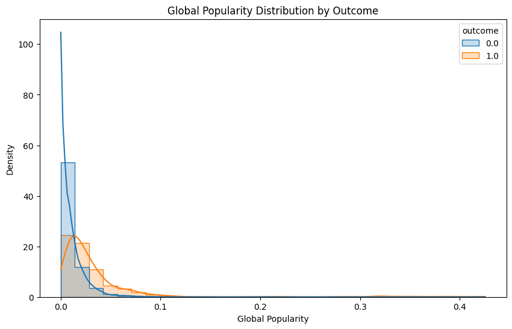
    


This plot indicates that products more popular tend to have a more positive outcome than the less populars. This makes sense since usually the most popular products are the basics.


```python
# Create family_size feature
family_info = ['count_children', 'count_adults', 'count_babies', 'count_pets']
family_size = data[family_info].sum(axis=1)
data['family_size'] = family_size

plt.figure(figsize=(12, 6))
sns.boxplot(data=data, x='user_order_seq', y='family_size')
plt.title('Family Size vs User Order Sequence')
plt.xlabel('User Order Sequence')
plt.ylabel('Family Size')
plt.show()
```

    2025-10-06 12:30:23,003 - INFO - Using categorical units to plot a list of strings that are all parsable as floats or dates. If these strings should be plotted as numbers, cast to the appropriate data type before plotting.
    2025-10-06 12:30:24,268 - INFO - Using categorical units to plot a list of strings that are all parsable as floats or dates. If these strings should be plotted as numbers, cast to the appropriate data type before plotting.


    
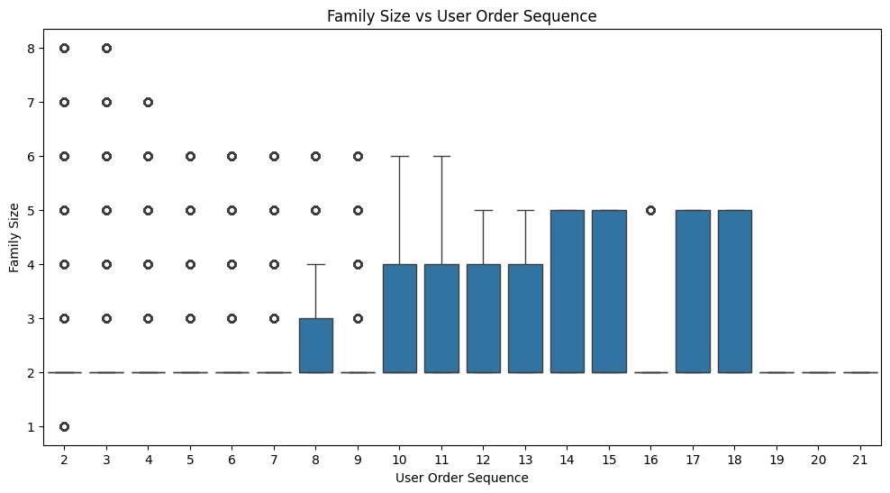
    


The boxplot shows the distribution of family sizes for each user order sequence of supermarket orders. Early order sequences contain families of various sizes, reflected by wider and lower boxes with many outliers, indicating diverse family sizes. For later order sequences, only smaller families appear, resulting in fewer outliers.


```python
# Plot between avg_days_to_buy_product_type and discount_pct
plt.figure(figsize=(10, 6))
sns.scatterplot(data=data, x='avg_days_to_buy_product_type', y='discount_pct', hue='outcome', alpha=0.6)
plt.title('Avg Days to Buy Product Type vs Discount Percentage by Outcome')
plt.xlabel('Avg Days to Buy Product Type')
plt.ylabel('Discount Percentage')
plt.legend(title='Outcome')
plt.show()
```

    /Users/maria/Desktop/Zrive DS/zrive-ds/.venv/lib/python3.11/site-packages/IPython/core/pylabtools.py:170: UserWarning: Creating legend with loc="best" can be slow with large amounts of data.
      fig.canvas.print_figure(bytes_io, **kw)


    
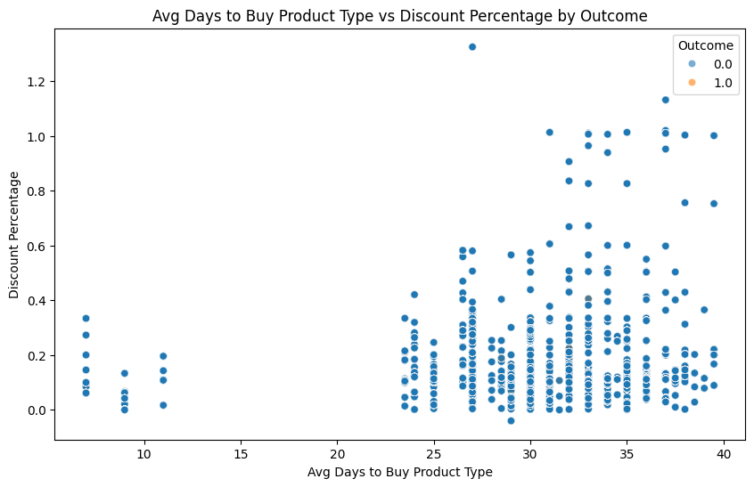
    


There’s no strong linear relationship between average days to buy and discount percentage. Products bought more frequently tend to have lower or stable discounts, while those purchased less often show higher variability in discounts, that could be due to marketing strategies to boost sales.
Also, there is no big relation to `outcome`, so the discount doesn't seem to be something relevant.


```python
fig, axes = plt.subplots(2,1, figsize=(16, 8))

sns.histplot(data['avg_days_to_buy_variant_id'].dropna(), bins=50, kde=True, ax=axes[0], color='blue')
axes[0].set_title('Avg Days to Buy (variant_id)')
axes[0].set_xlabel('Average Days to Buy (variant_id)')
axes[0].set_ylabel('Density')

sns.histplot(data['std_days_to_buy_variant_id'].dropna(), bins=50, kde=True, ax=axes[1], color='orange')
axes[1].set_title('Std Days to Buy (variant_id)')
axes[1].set_xlabel('Standard Days to Buy (variant_id)')
axes[1].set_ylabel('Density')

plt.tight_layout()
plt.show()
```


    
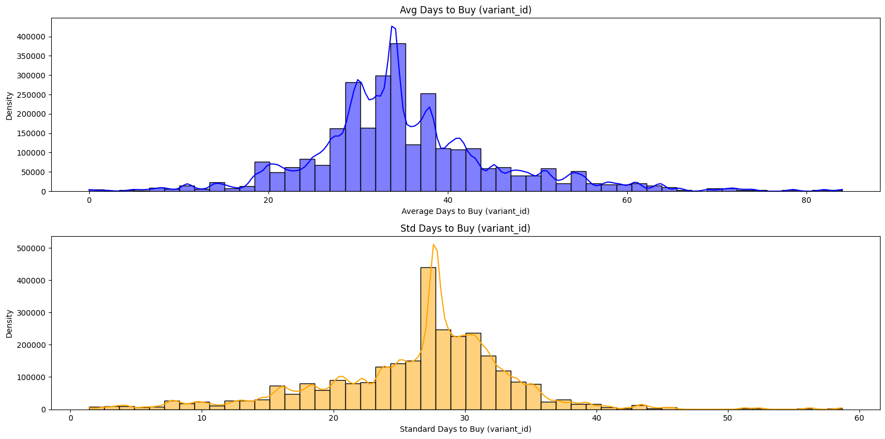
    


The average plot shows that most products are repurchased within 25 to 40 days, while the standard deviation peaks between 25 and 30 days. This suggests that most products tend to be bought on a monthly basis.


```python
# plot relation between outcome and user_order_seq
plt.figure(figsize=(10, 6))
sns.boxplot(data=data, x='outcome', y='user_order_seq')
plt.title('User Order Sequence by Outcome')
plt.xlabel('Outcome')
plt.ylabel('User Order Sequence')
plt.show()
```

    2025-10-06 11:14:02,041 - INFO - Using categorical units to plot a list of strings that are all parsable as floats or dates. If these strings should be plotted as numbers, cast to the appropriate data type before plotting.
    2025-10-06 11:14:03,490 - INFO - Using categorical units to plot a list of strings that are all parsable as floats or dates. If these strings should be plotted as numbers, cast to the appropriate data type before plotting.


    
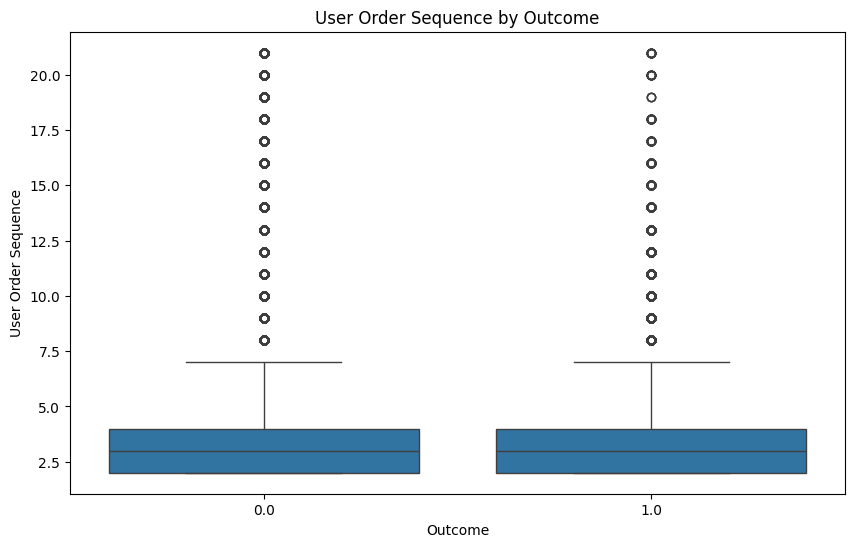
    


The distribution of user order sequences is very similar for both outcomes. Most purchases occur between the second and fourth order, and a few users show more orders. Overall, the order sequence doesn’t seem to strongly influence whether a product is bought or not.

### Conclusions

The analysis reveals some patterns in supermarket ordering behavior. Outcome is moderately correlated with product history: items ordered or set as regular are more likely to be repurchased, while previously abandoned products also show a higher likelihood of future purchase, suggesting shoppers often plan future buys. Product popularity drives positive outcomes and family composition appears to influence ordering dynamics, with sequence patterns shaped by family size, but the impact is not strong enough to fully determine ordering behavior.

In summary, purchase patterns are most shaped by habit and popularity; family size and discounts play a contextual but less decisive role, and most purchases occur in regular intervals of about a month. These insights provide a foundation for identifying key drivers of supermarket buying behavior and targeting future analysis.
